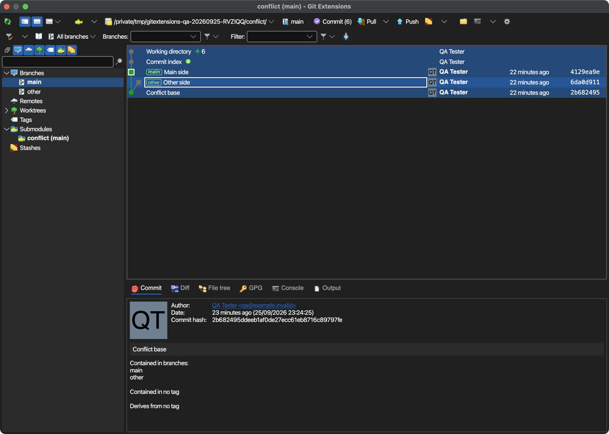
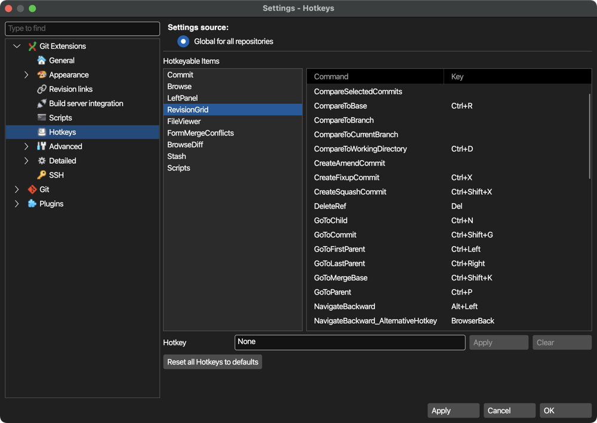

# macOS QA pass, 2026-09-25–26

Follow-up to [QA.md](QA.md), starting at `087efe81a` on `avalonia`.
Apple silicon, macOS 26.6.2, .NET SDK 10.0.401, Git 2.55.0. The Release application was copied to a
portable scratch directory. All Git operations used scratch repositories and an isolated global Git configuration.
The initial runs also used a scratch HOME; later merge-tool and credential checks used the real HOME with
`GIT_CONFIG_GLOBAL` pointing to the scratch configuration. No `GIT_EDITOR` override was inherited.

## Fixed and pushed

Commit **`57e71ce9e`** (`origin/avalonia`):

- **First-run stack overflow.** After language selection and declining telemetry, assembly resolution could recurse
  through localized exception-resource loading while `FileVersionInfo` inspected unrelated adjacent files.
  Resolve the exact assembly filename instead, including the culture directory for satellite assemblies.
  Regression coverage checks dependency resolution, prefix collisions, missing satellites and absent requesting assemblies.
  The dependency-resolution test failed before the fix; the repaired portable app reached the checklist and dashboard.
- **Checkout errors while typing.** Entering `feature` caused git commit-count requests for `f`, `fe`, `fea`, etc.,
  and nested error dialogs for invalid revisions. Only request counts for branches in the available list.
  Local and remote partial-name regressions failed before the change and passed after it. Typing the full name and
  checking out the branch then succeeded in the application.
- **Locale-sensitive tests.** Two existing headless tests assumed decimal points in localized values. Their input
  and expected display values now use the active culture. Application formatting was not changed.

Release solution build passed. All **18** test-suite invocations passed, sequentially, with
`--no-build --blame-hang-timeout 3m`: **25,277 passed, 0 failed**. The TRX files register 25,437 tests;
160 were outside the executed set, including platform exclusions. Windows-only UI integration tests do not run on
macOS. `GE_TEST_KEYCHAIN=1` exercised save/read/update/remove. Windows and Linux were not rerun in this macOS
pass. The separate `fedccd597` update records successful Windows/WSL builds, suites and portable smoke tests
at `57e71ce9e`; those results are preserved in the handoff and ledger.

## Manual coverage

| Area | Observed result |
| --- | --- |
| Startup | Language and telemetry dialogs, checklist repairs, dashboard, repository opening, local clone and recent-repository menu passed after the startup fix. |
| Main window | Revision graph, selection/context menus, branches/remotes/tags/stashes/worktrees/submodule tree, commit information, diff and file tree rendered. File history opened a filtered history; blame showed authors beside the lines. Cmd+C has an open issue below. |
| macOS conventions | Native application/main menus, About, Cmd+, settings, Cmd+Return commit, Cmd+Q shutdown, and Cancel-before-OK/No-before-Yes ordering checked. Light and dark rendered; System color mode was selected and retained after restart with the current dark system appearance. Live OS appearance switching was not exercised. |
| Commit | Staged a file, committed through Cmd+Return, and amended after confirmation; verified the resulting commits with Git. The unstage attempt was not independently verified and is not counted as a pass. |
| Network Git | Local push, fetch and fast-forward pull passed. Local OpenSSH fetch showed the host-key question and masked key-passphrase prompt. HTTPS push to a local TLS Git server showed username/password askpass and updated the bare remote. SSH push and public hosting services were not repeated. |
| Branch/history operations | Create, checkout, rename, delete, merge, rebase, cherry-pick, revert and hard reset passed in scratch fixtures. Revert opened the application file editor for its commit message; save/close completed the operation. |
| Repository management | Stash save/apply, tag creation, worktree creation, remote color/prefix save, and submodule display/synchronize/update passed. Remote config contained the chosen color and `qa/` prefix. Submodule checkout-update prompts also completed after history operations. |
| Conflicts | FileMerge, P4Merge, Sublime Merge and VS Code saved actual resolutions; Git Extensions staged the files and offered to commit. KDiff3, Meld and Beyond Compare opened the correct input/output files; their complete save/return cycle was not established in this run. |
| External diff | Diff-tab context menu launched FileMerge comparing the selected commit and its parent, with the expected temporary file arguments. |
| Settings/pickers | Git configuration/tool selections, Colors, Fonts, Hotkeys, Scripts, Advanced and build-server pages inspected. Font picker retained decimal size `9,75`; native folder selection worked. Native Save produced `saved-qa.txt` with the expected content. Color picker showed its tab icons and saved the selected color. Hotkey labels have an open issue below. |
| Plugins/terminal | Find large files located a generated 2.2 MB blob and displayed a localized size; Statistics displayed contributor counts; Delete obsolete branches populated its candidates. The embedded zsh console executed a marker command. |
| Build server/credentials | Fake local Jenkins accepted the entered credentials (HTTP 200) and reused them after application restart without prompting. The corresponding Keychain item was verified absent before the test and removed afterwards. |

P4Merge initially remained at its file picker. The user identified and approved a Gatekeeper prompt. A fresh launch
then opened the comparison and completed a saved resolution. This is **not recorded as a P4Merge integration defect**.

This is a broad click-through, not an all-green sign-off. Still not exercised completely in this run: unstage,
script execution (the page was inspected), dedicated search/filter workflows beyond file history and the settings
search box, live system-theme changes, the three merge-tool save/return cycles noted above, all alternative editor
and external-diff choices, and a build-status result rendered from a nonempty server response. Araxis and DiffMerge
were not available for testing. No repository plugin exposes a `CredentialsSetting` page.

## Open findings

Both were addressed afterwards (see the ledger): the first is an artifact of the System Events input, the second is
fixed.

### Revision-grid Cmd+C changes the selection under automated input

1. Open a scratch repository with multiple commits and artificial working-directory/index rows.
2. Click one commit's subject cell so it has the focus rectangle.
3. Send Cmd+C (`osascript`: `key code 8 using command down`).
4. Every row becomes selected. The clipboard contains every commit hash, including the artificial `111…`/`222…`
   identifiers, instead of only the selected commit's hash.

Reproduced in multiple app runs with both scratch and real HOME. Expected: preserve the selection and copy its
commit hashes. The existing headless `Copy_puts_the_hash_of_the_selected_revision_on_the_clipboard` test passes;
`OnGridKeyDown` itself copies the view model's selection. A physical-key check and native event/selection tracing
are needed to distinguish the automated input path from an Avalonia native-backend issue. No speculative fix was made.
The clipboard contents present before each check were restored.

### Hotkeys settings shows Ctrl instead of Cmd

Open Settings → Hotkeys → RevisionGrid. The table labels shortcuts `Ctrl+R`, `Ctrl+D`, `Ctrl+P`, etc., while macOS
uses Command for those bindings. Expected: the displayed modifiers agree with the platform shortcuts.
`HotkeysSettingsHost.ToText` uses `Keys.ToText`, whose modifier formatter still emits `Ctrl`. The shared formatter
also feeds other shortcut displays; its callers and gesture parsing need review before changing it globally.
This display issue remains open; shortcut storage should keep its existing portable representation.

## Cleanup and evidence

- All QA Git Extensions instances, merge-tool processes (including Meld multiprocessing helpers), and the local SSH,
  HTTPS and Jenkins servers were closed. The final process scan found no matching QA processes.
- The real `~/.gitconfig` SHA-256 is unchanged from the pre-test snapshot.
- The opt-in Keychain test removed its item; `GitExtensions_BuildServer_127.0.0.1` was explicitly deleted after the
  Jenkins test. The final Keychain metadata dump contains no GitExtensions entries.
- The full Keychain metadata hash differs from the pre-test hash. An existing `com.apple.continuity.encryption`
  item has a modification timestamp during this session. Only a hash was retained before the test, so the exact
  complete metadata difference cannot be proven; whole-Keychain equality is **not claimed**. No existing item was
  deleted or restored to force a matching hash.
- Scratch repositories, screenshots, application logs and TRX evidence remain locally in
  `/tmp/gitextensions-qa-20260925-RVZIQQ`. `final-results/summary.json` records the suite exit codes;
  `build-final.log` records the build. These temporary artifacts are not required to read the findings above.
